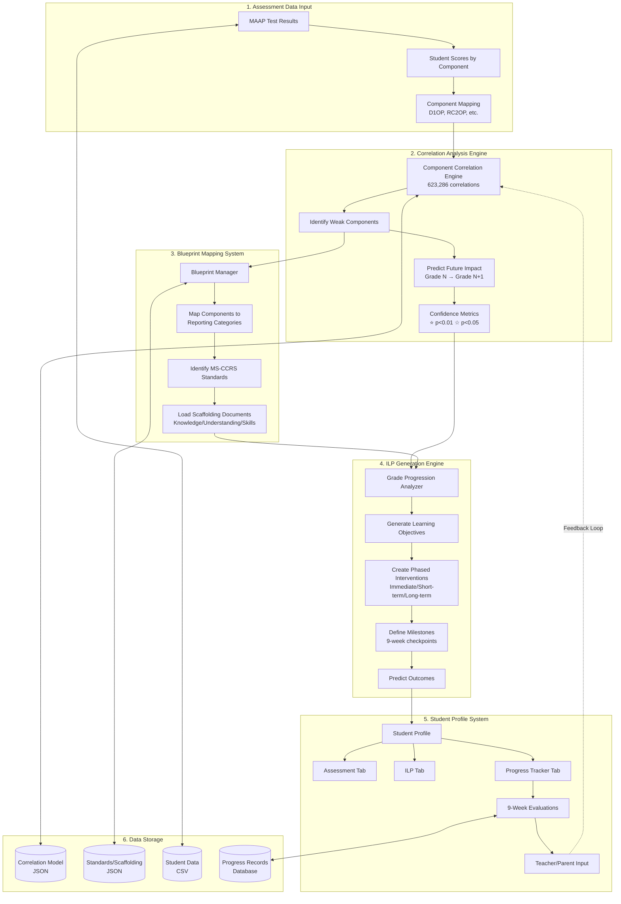
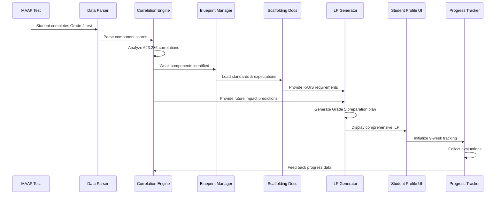
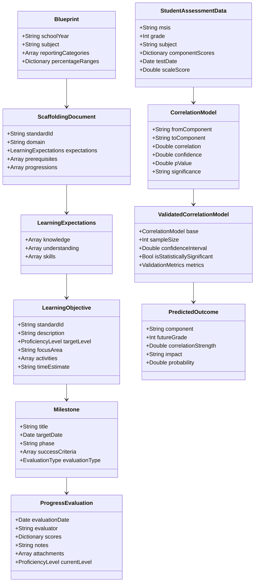

# Blueprint Integration System Architecture

## System Data Flow Diagram



## Component Interaction Diagram



## Data Model Architecture



## Key System Flows

### 1. End-of-Year Assessment Flow
```
Grade 4 Test (May) → Analysis (June) → Grade 5 ILP (July) → Implementation (August-May)
```

### 2. Correlation-to-Intervention Flow
```
Weak Component → Correlation Prediction → Standard Mapping → Scaffolding → Targeted Activities
```

### 3. Progress Tracking Flow (9-Week Cycles)
```
Baseline → Week 9 Eval → Week 18 Eval → Week 27 Eval → Week 36 Final
         ↓              ↓               ↓              ↓
    Report Card    Report Card    Report Card    Report Card
         ↓              ↓               ↓              ↓
    ILP Adjust     ILP Adjust     ILP Adjust    Next Grade Plan
```

## Technology Stack

- **Data Storage**: JSON (Standards, Blueprints), CSV (Assessment Data), CoreData (Progress)
- **Processing**: Swift 6.0, MLX Framework for correlations
- **UI**: SwiftUI for iOS/macOS apps
- **Analytics**: Statistical Engine with Pearson correlations
- **Export**: PDF, HTML, CSV for reports

## Critical Integration Points

1. **Correlation Engine ↔ Blueprint Manager**: Component to standard mapping
2. **Scaffolding Documents ↔ ILP Generator**: Learning expectations to objectives
3. **Progress Tracker ↔ Correlation Model**: Feedback loop for model refinement
4. **9-Week Evaluations ↔ Milestone Tracking**: Progress validation